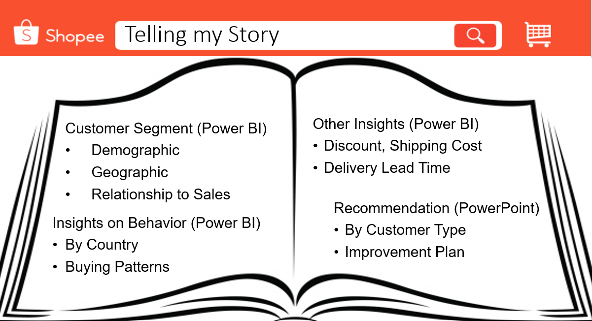

# SCTP-Capstone 4 Shopee Brazil

Analyze data with 2 objectives:
- Understand Shopee Customers in Latin America
- Make recommendation to improve customer experience and revenue

Dataset on Customer and Purchase were provided. The additional data preparation work were done in Power Query.
- Classify Age, Income, Discount, Delivery Lead Time,  Shipment Cost into separate bucket
- Remove Product Description
- Define new Table for Date
- Define new table with product name classify into different category
- More information can be found in the data dictionary in the powerpoint slide

